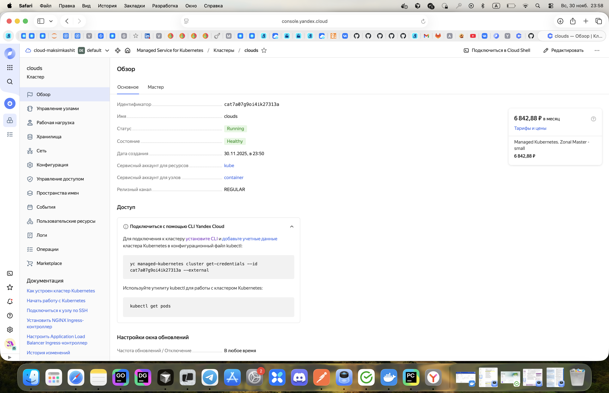
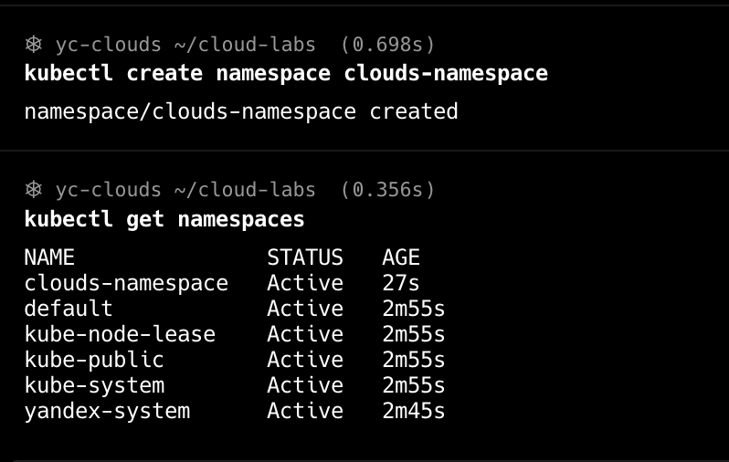
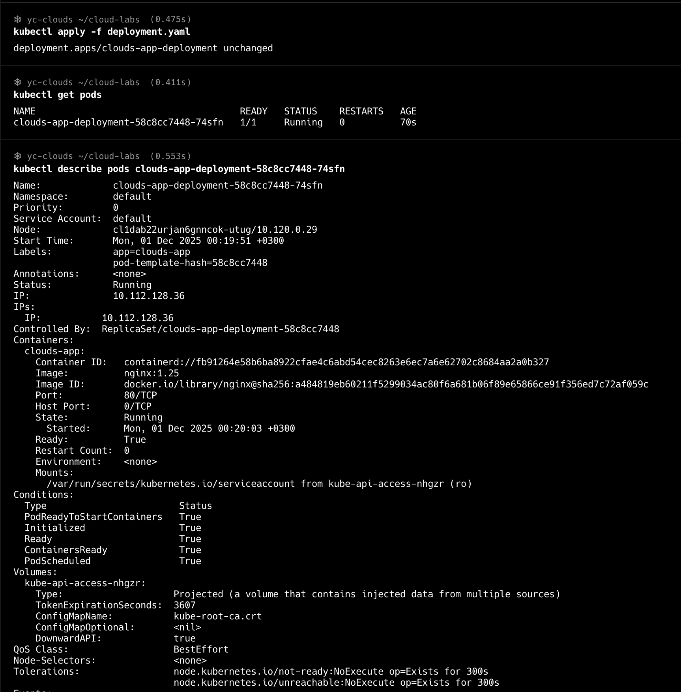
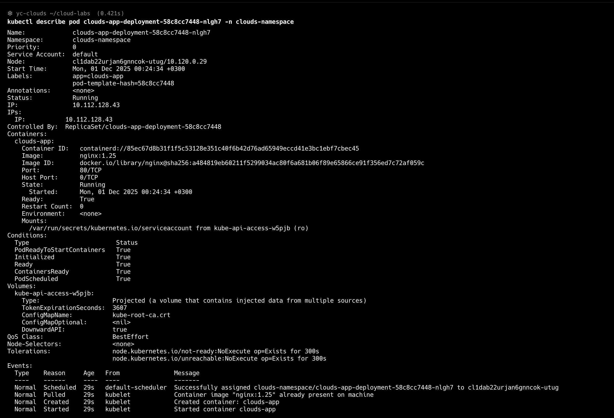
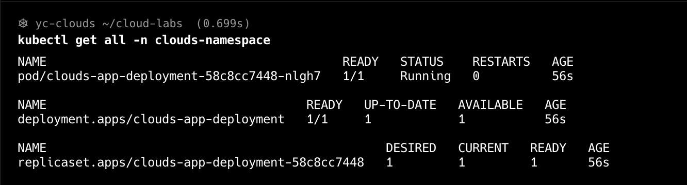
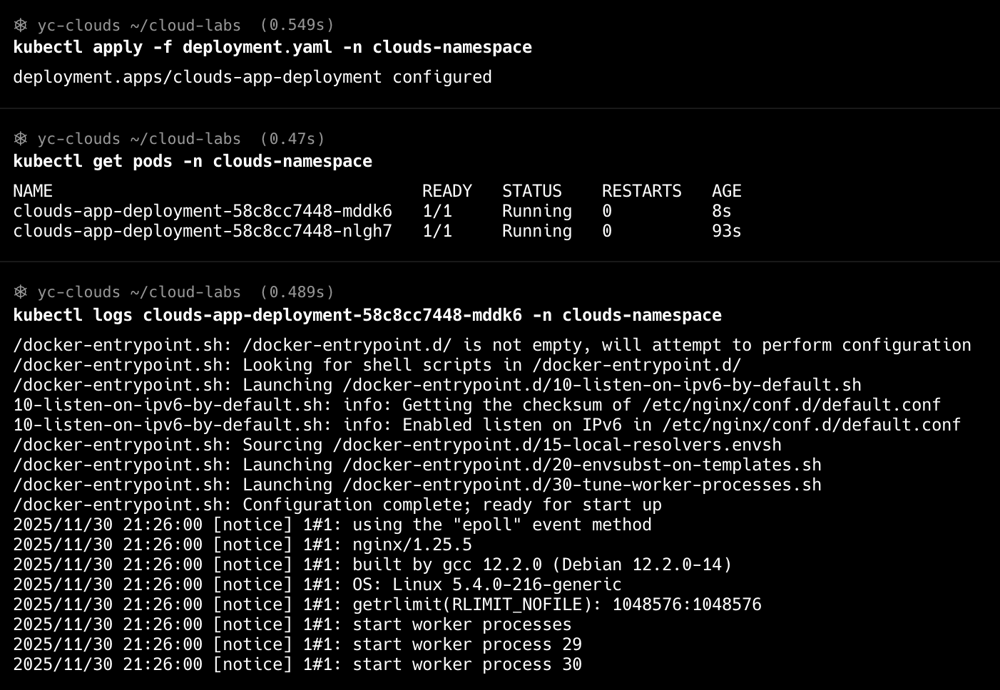
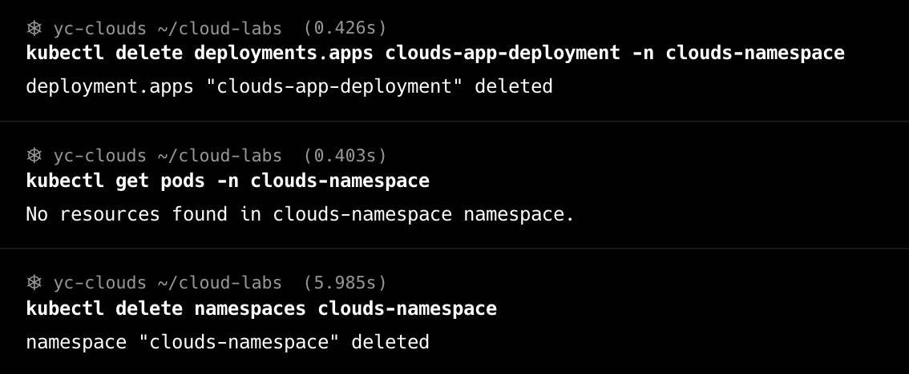

### 1. Создан kubernetes кластер

### 2. Созданы namespace и deployment

### 3. Описание пода

### 4. Все объекты в namespace

### 5. Изменение количества реплик + логи

### 6. Удаление Deployment и Namespace

