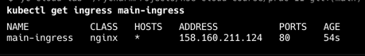
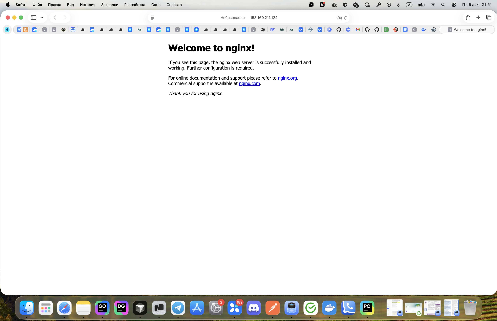
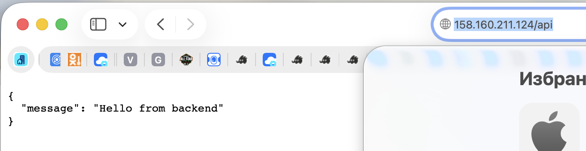

## Важно!
Убедиться, что у сервисного аккаунта есть роль `load-balancer.admin`

## Часть 1

### Развертывание

1. Нужно развернуть `ingress-controller`
```commandline
kubectl apply -f https://raw.githubusercontent.com/kubernetes/ingress-nginx/main/deploy/static/provider/cloud/deploy.yaml
```

2. Применяем манифесты. Либо отдельно каждый, либо все сразу
```commandline
kubectl apply -f manifests/
```

3. Для получения `EXTERNAL_IP` прописываем
```commandline
kubectl get ingress main-ingress
```

Пример вывода:



### Артефакты

#### /:


#### /api:


#### /health:

