# Практическая работа №14: Настройка полноценного стека Observability в Kubernetes

##  Kubernetes-кластер

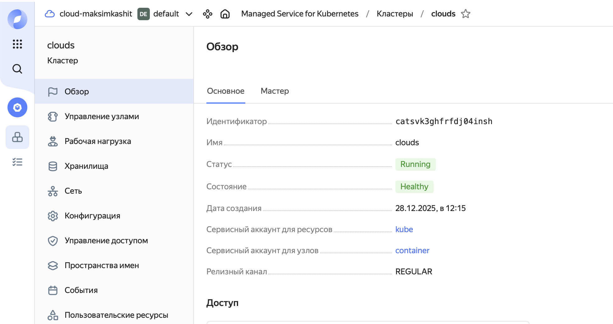

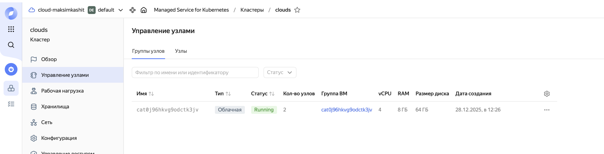

## Dashboards

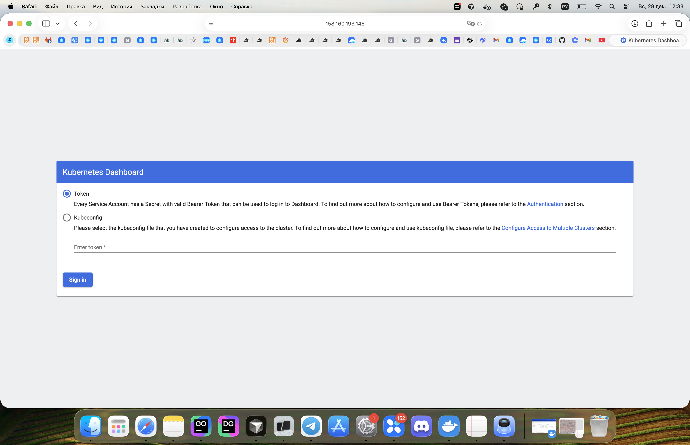
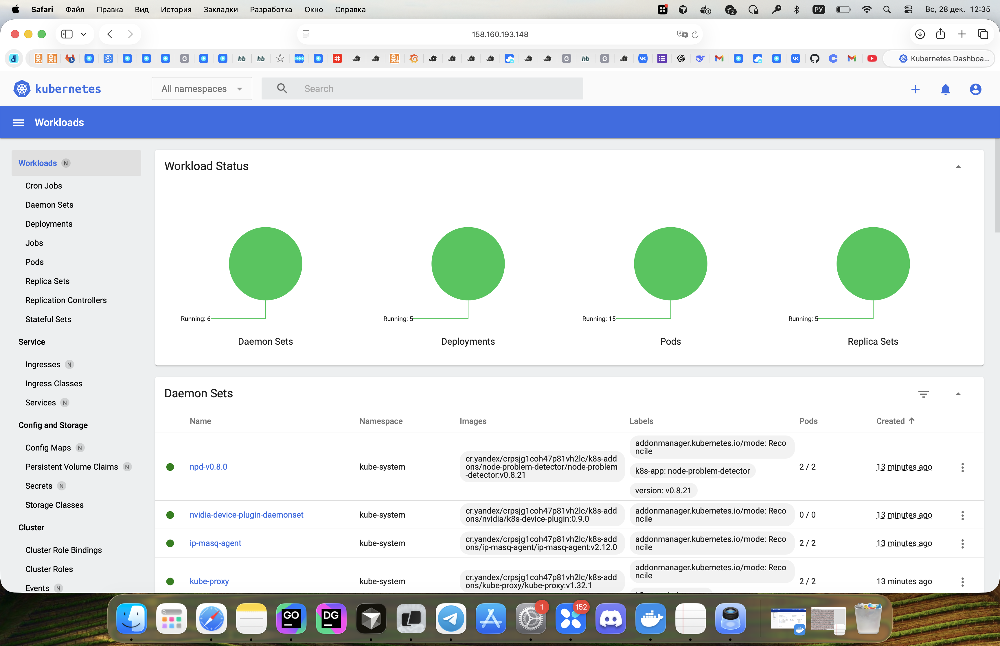

## Logging

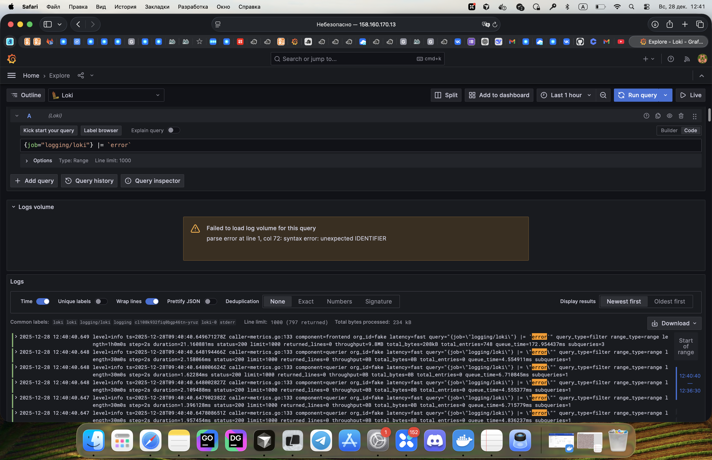

## OpenTelemetry demo

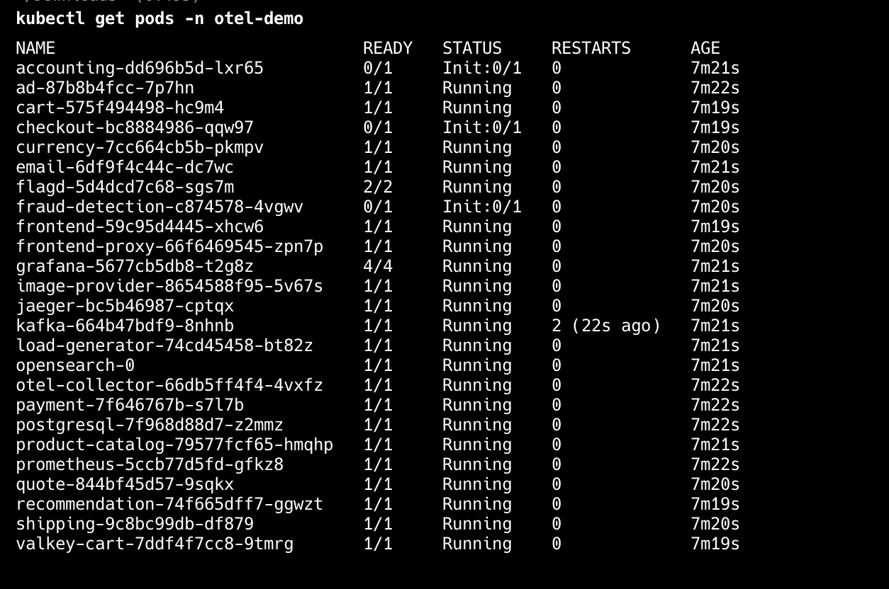

## Prometheus

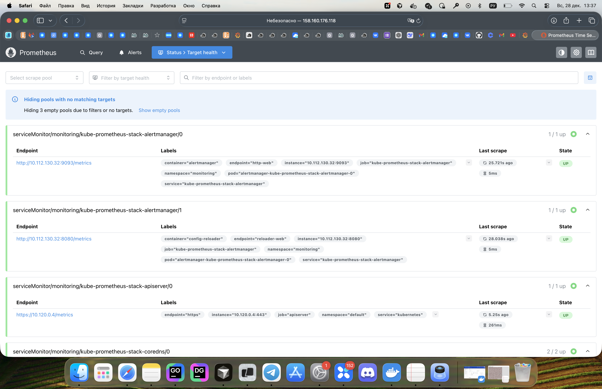

## Alerts

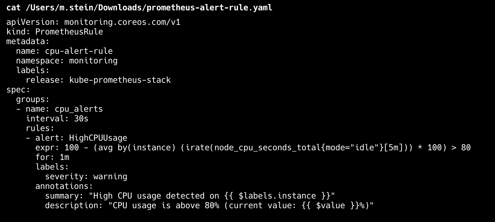
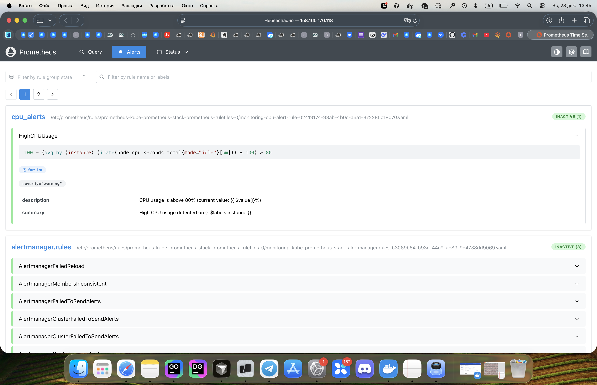
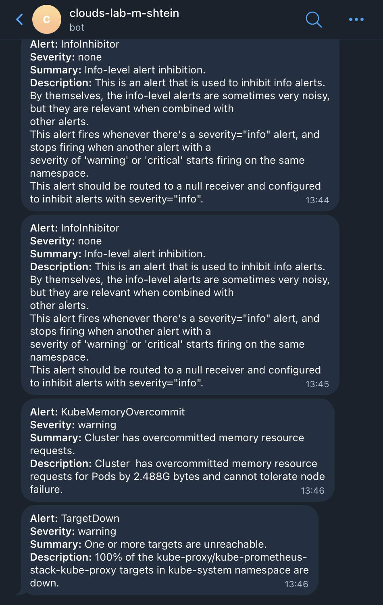

## Jaeger

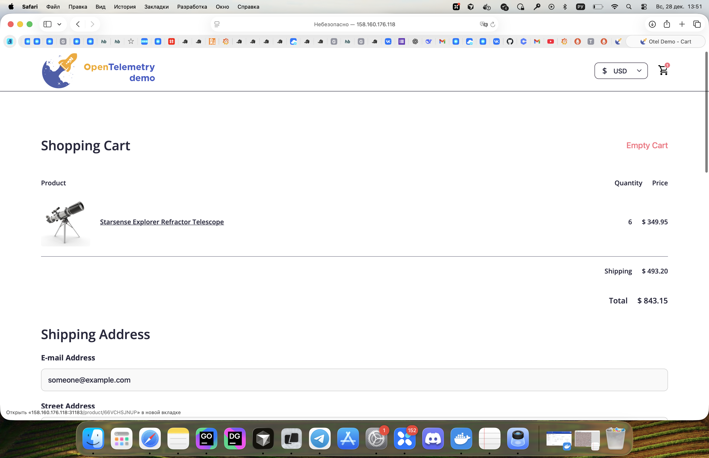
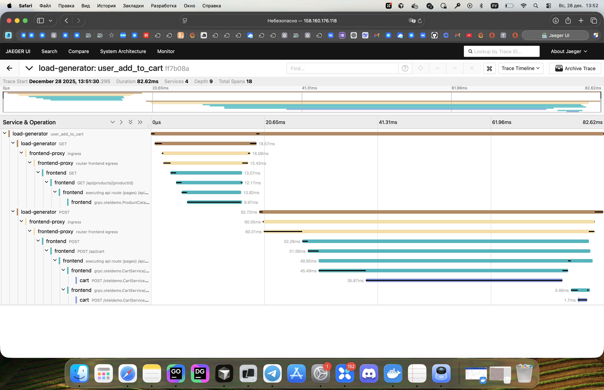
