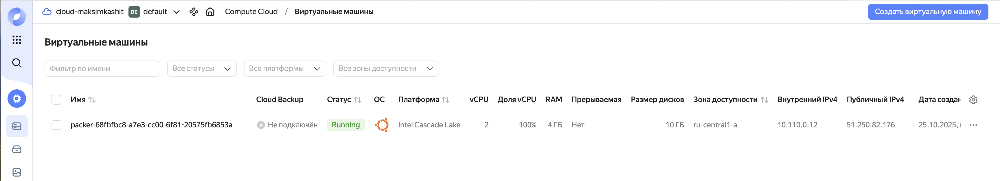
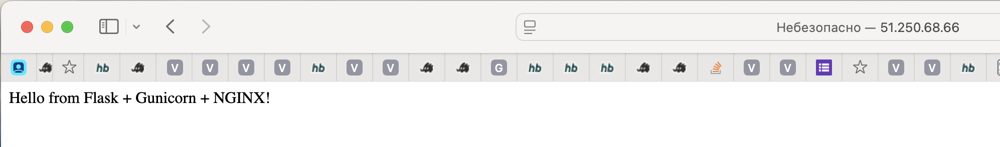

## Запуск
Для запуска нужно использовать команду 
```
packer build -var="token=YOUR_TOKEN" -var="folder_id=YOUR_FOLDER_ID" -var="subnet_id=YOUR_SUBNET_ID" packer/packer.pkr.hcl
```

## Артефакты
### VM


### Disk


### Браузер
