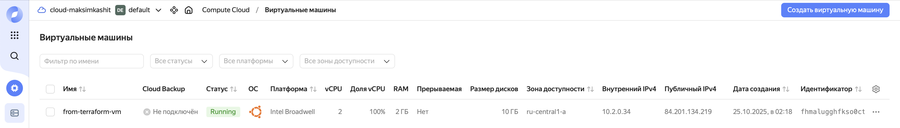
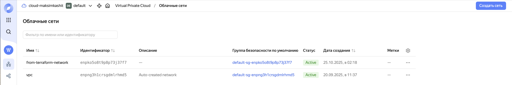
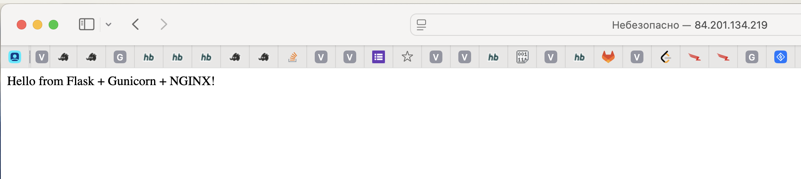
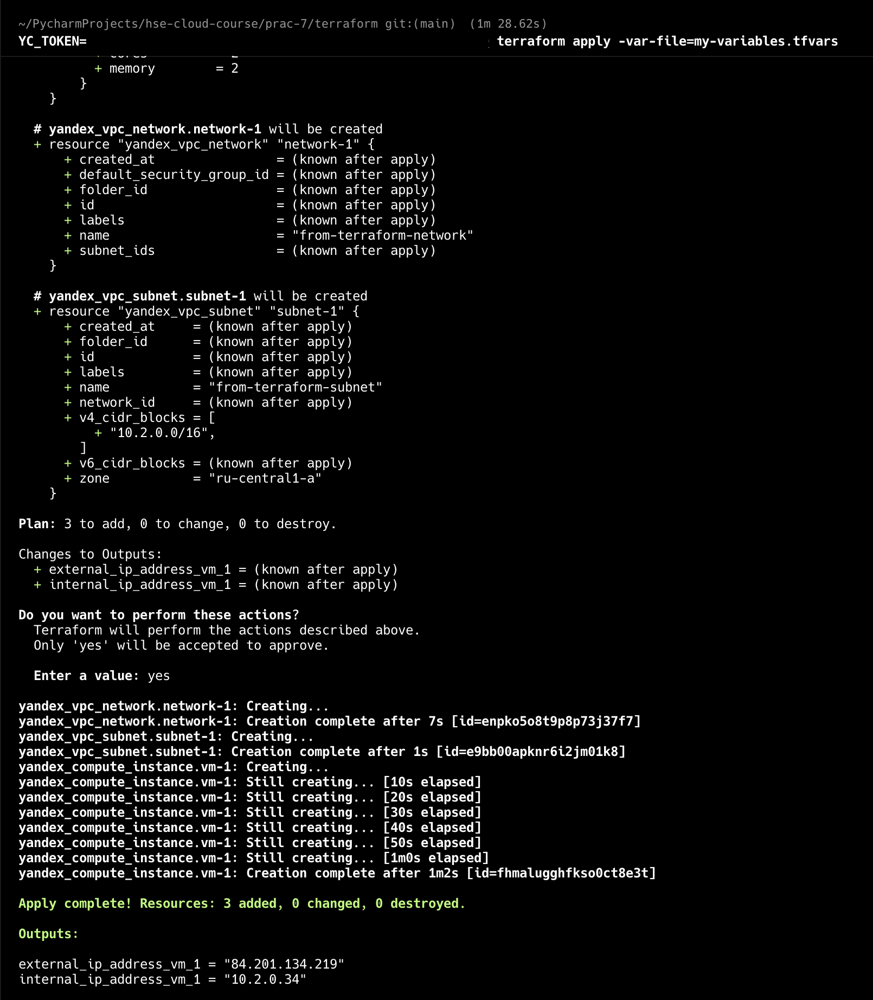

## Запуск
Для запуска нужно использовать команды 
```
cd terraform
YC_TOKEN=<TOKEN> terraform apply -var-file=my-variables.tfvars
```

## Артефакты
### VM


### Сеть


### Браузер


### Консольная команда


