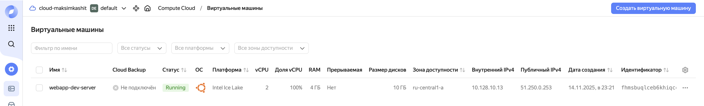
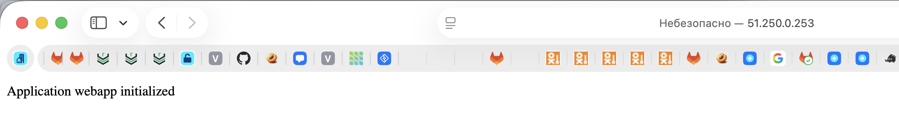
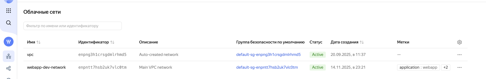
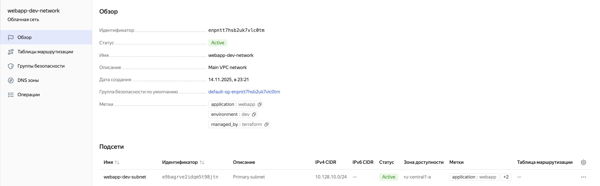
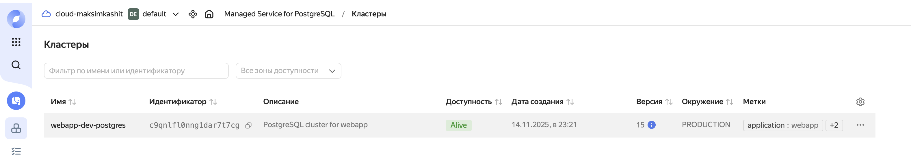
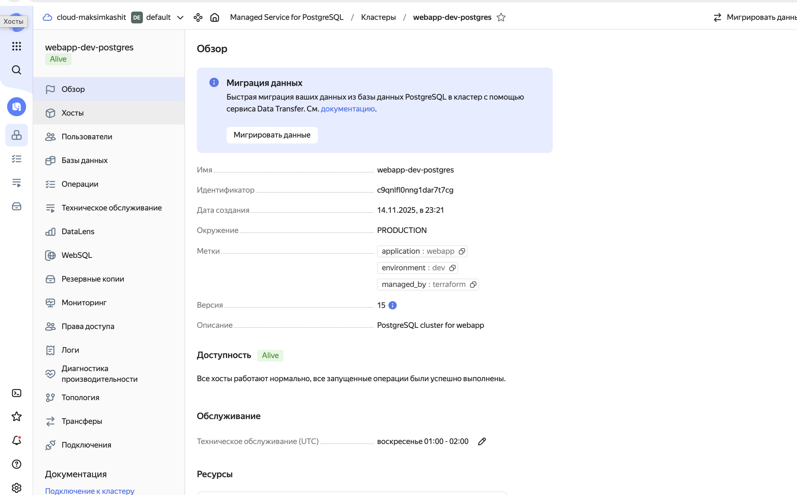
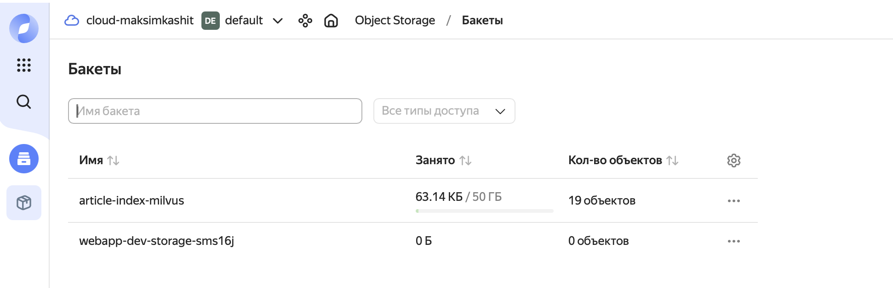

## Развертывание

Для развертывания нужно создать файл `terraform.tfvars` и прописать нужные переменные

После нужно выполнить
```bash
terraform init
terraform apply
```

## SSH к серверу

```bash
ssh ubuntu@$(terraform output -raw server_external_ip)
```

## Подключение к PostgreSQL

```bash
psql "$(terraform output -raw connection_string)"
```

## Артефакты

### VM




### VPC




### PostrgreSQL





### Object Storage


